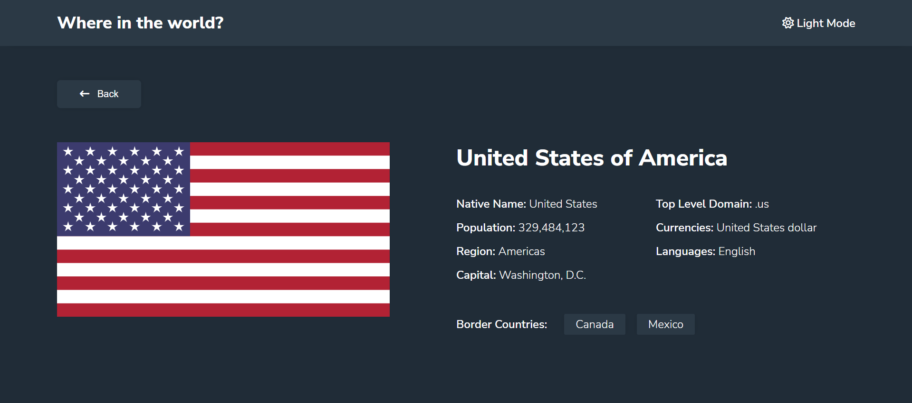

# Countreez

This is a solution to the [REST Countries API with color theme switcher challenge on Frontend Mentor](https://www.frontendmentor.io/challenges/rest-countries-api-with-color-theme-switcher-5cacc469fec04111f7b848ca). Frontend Mentor challenges help you improve your coding skills by building realistic projects.

Live Site URL: [https://countreez.netlify.app/](https://countreez.netlify.app/)

## Table of contents

- [Overview](#overview)
  - [The challenge](#the-challenge)
  - [Screenshots](#screenshots)
- [Built with](#built-with)
- [Project setup](#project-setup)

## Overview

### The challenge

Users should be able to:

- See all countries from the API on the homepage
- Search for a country using an `input` field
- Filter countries by region
- Click on a country to see more detailed information on a separate page
- Click through to the border countries on the detail page
- Toggle the color scheme between light and dark mode *(optional)*

### Screenshots

#### Home Page

<div style="display: flex; flex-direction: column; align-items: center">
  
  <br />
  
</div>

#### Country Details Page

<div style="display: flex; flex-direction: column; align-items: center">
  
  <br />
  
</div>

#### Responsive

<div style="display: flex; align-items: flex-start; justify-content: center">
  &nbsp;&nbsp;&nbsp;&nbsp;&nbsp;&nbsp;&nbsp;&nbsp;
  
</div>

## Built with

- [Vue](https://vuejs.org/) - JavaScript Framework
- [Sass](https://sass-lang.com/) - For styles

## Project setup

### Clone the project

```bash
git clone https://github.com/abdullahalshawafi/Countreez.git
```

### Install the needed dependencies

```bash
npm install
```

### Start the development server

```bash
npm run serve
```

The website will start running at [http://localhost:8080](http://localhost:8080)

### Build the project for production

```bash
npm run build
```
